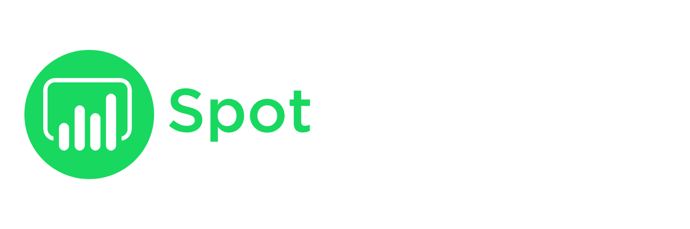

  

## 📚 Índice
1. [🎧 ¿Qué es SpotInsights?](#-qué-es-spotinsights)
2. [⚙️ ¿Qué hace el Frontend?](#-qué-hace-el-frontend)
3. [🚀 Deployment](#-deployment)
4. [🖼️ Secciones del sitio](#️-secciones-del-sitio)
5. [🔒 Seguridad](#-seguridad)
6. [🛠️ Tecnologías utilizadas](#️-tecnologías-utilizadas)

## 🎧 ¿Qué es SpotInsights?

**SpotInsights** es un proyecto que integra el Desarrollo FullStack con el Análisis de Datos. Su objetivo principal es recopilar y analizar los datos de reproducción musical de los usuarios a través de la API de Spotify.

El proyecto se compone de tres partes:

- **Frontend (este repositorio):** presenta el proyecto al usuario, explica su propósito y permite autorizar el acceso a sus datos musicales.

- **Backend:** recibe y almacena los datos en una base de datos, y se encarga de actualizar automáticamente las reproducciones de los usuarios cada cierto período.

- **Análisis de datos:** accede a la base de datos y genera un dashboard en Power BI para visualizar patrones de escucha de la comunidad.

---
## ⚙️ ¿Qué hace el Frontend?

Este repositorio corresponde al **Frontend** del proyecto, diseñado para brindar una experiencia clara y transparente al usuario: explicando los objetivos, el uso de los datos y dándole la bienvenida a la comunidad.

Funciones principales:
- Conecta con tu cuenta de Spotify de forma segura mediante OAuth.
- Accede a tus últimas canciones reproducidas para analizarlas.
- Envía esa información al backend, donde se procesa y almacena.
- Ofrece una interfaz clara con secciones sobre el proyecto, preguntas frecuentes y contacto.

> [!NOTE]  
> Si bien el FrontEnd ya está funcional y desplegado, el proyecto general aún está en desarrollo. Actualmente, se continúa trabajando en la integración completa con el backend y en la automatización del análisis de datos.

---

## 🚀 Deployment
La aplicación ha sido desplegada en Vercel.

🔗 [Acceder a la app](https://spotinsights.vercel.app)

---

## 🖼️ Secciones del sitio

### 🏠 Home
- **Bienvenida** con descripción del proyecto y logo central.
- Botón para iniciar sesión con Spotify.

### ℹ️ FAQs
- Preguntas frecuentes sobre privacidad, acceso a cuenta y visualización de datos.
- Sección educativa para generar confianza en el usuario.

### 🔁 Redirección post-login
- Página especial a la que el usuario accede tras autorizar la app en Spotify.
- Muestra un mensaje de éxito.
- Explica brevemente que los datos fueron extraídos y que luego se reflejarán en un dashboard.

---

## 🔒 Seguridad

- El acceso a Spotify se realiza a través del login oficial, sin almacenar contraseñas.
- Solo se utilizan datos de reproducción, no información personal sensible.

---

## 🛠️ Tecnologías utilizadas

- **React** con Vite
- **React Router** para navegación
- **CSS** para estilos
- **Spotify Web API** (solo autenticación y datos de reproducción)
- **Vercel** para despliegue

---
